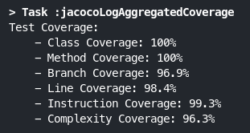

  <h1 name="asd" style="font-size: 3.5em" >Desafio Capgemini</h1>
   
   
  

 

> Desafio de programação pela Academia Capgemini feita em Java e Gradle

## 💻 Pré-requisitos

Antes de começar, verifique se você atendeu aos seguintes requisitos:
<!---Estes são apenas requisitos de exemplo. Adicionar, duplicar ou remover conforme necessário--->
* Você instalou a versão >= 11.0 do `Java`
* Você instalou a versão >= 7.4 do `Gradle`

## 🚀 Instalando

- #### Clonando o repositorio:

1. `git clone https://github.com/iDallek/desafio-capgemini.git`
2. `cd desafio-capgemini`

- #### Rode o Gradle e instale as dependencias:

1. `./gradlew clean build` no Linux/Mac ou `gradlew.bat clean build` no Windows.

## 🤖 Visualisando os Testes

Para visualizar os testes: 

- `./gradlew clean test` no Linux/Mac ou `gradlew.bat clean test` no Windows.
- E com cobertura: `gradle jacocoAggregatedReport` 

## 📝 Licença

Esse projeto está sob licença. Veja o arquivo [LICENÇA](LICENSE.md) para mais detalhes.
